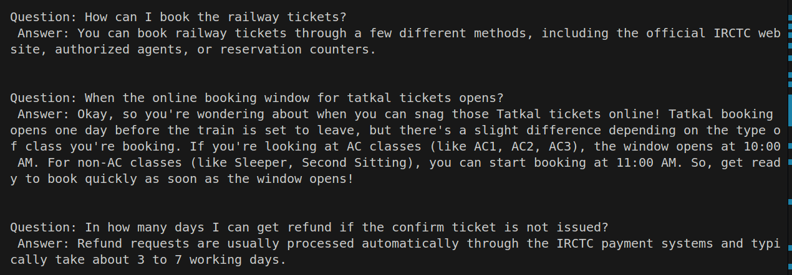
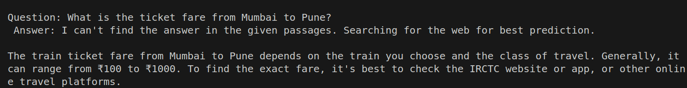
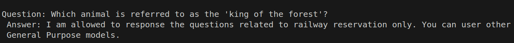

# RAG based QA using Vector DB

---

## 📘 Features

- Embeddings representation using vector db
- Text similarity search from file to find the closest match answers for a given question (Retrieval)
- Using Generative AI, augment the result and generate answers for a given question (Augmentation and Generation)


## ⚙️ How to Run

### 1. Clone the Repository
```
$ git clone https://github.com/pandyahariom/ai-rag-railway-qa.git
```

### 2.Set Up the Virtual Environment
```
$ python3 -m venv ai
$ source ai/bin/activate
```

### 3.Install the dependencies
```
$ pip install -r requirements.txt
```

### 4.Execute the code locally
```
$ python3 main.py
```

## 🖼️ Expected Output

  Below is an example of how the RAG based QA works for a given question and knowledge base:
  
  

  
  If the query is related to the railway reservation but not part of the given minimal knowledge base, the system will respond by searching the web for the best prediction.
  
  

  
  If the question is not related to the railway reservation system will not respond by searching the out of the passages.
  
  

